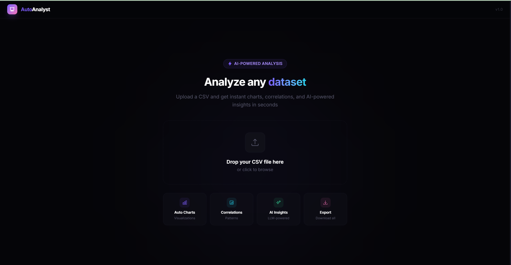
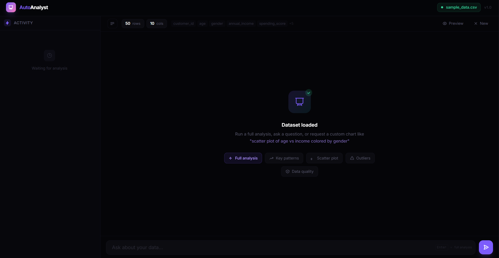
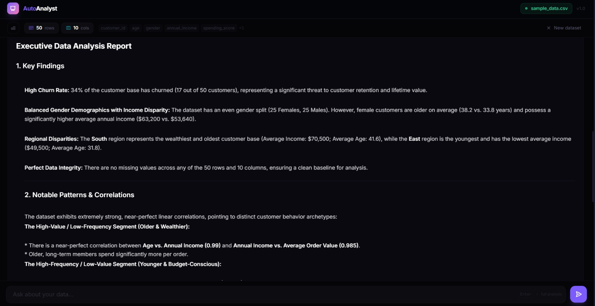
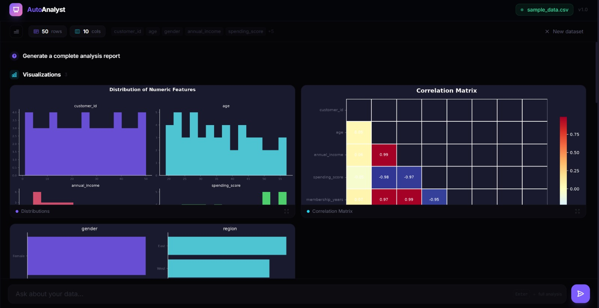

# AutoAnalyst

An autonomous data analysis agent powered by **LangGraph ReAct**, **FastAPI**, and **Vue 3**. It receives CSV datasets, reasons about what analysis to run, dynamically executes Python code in an isolated REPL, and streams thoughts, code, charts, and reports over WebSockets in real time.

---
| Upload Page | Dataset Loaded |
|:-:|:-:|
|  |  |

| AI Insights Report | Agent-Generated Charts |
|:-:|:-:|
|  |  |
---

## Key Features

- **Autonomous ReAct Loop:** The agent decides what code to write, observes outputs/errors, and self-corrects until satisfied.
- **Stateful REPL Sandbox:** Executes Pandas/NumPy/Matplotlib code in a persistent Python namespace (`df`, `pd`, `np`, `plt`, `sns`).
- **Dynamic Chart Capture:** Intercepts Matplotlib figures, renders dark-themed 150 DPI PNGs, and streams Base64 strings to the frontend.
- **Real-Time Streaming:** Streams agent thoughts, generated code, stdout logs, charts, and final markdown reports over WebSockets.
- **Multi-Turn Memory:** Retains execution state and conversation history across follow-up queries using LangGraph `MemorySaver`.

---

## Tech Stack

| Layer | Technology | Purpose |
|---|---|---|
| **Agent Core** | LangGraph, LangChain | ReAct agent state machine & checkpointer |
| **LLM** | LLM Engine | Reasoning, code generation, & report synthesis |
| **Backend** | FastAPI, Uvicorn, WebSockets | Ingestion, REST routes, & stream handling |
| **Data & Viz** | Pandas, NumPy, Matplotlib, Seaborn | Execution runtime & chart rendering |
| **Frontend** | Vue 3, Tailwind CSS v4, Vite | Reactive dashboard & live stream renderer |

---

## Project Structure

```
autoanalyst/
├── backend/
│   ├── main.py          # FastAPI app, REST API & WebSocket handler
│   ├── agent.py         # LangGraph ReAct agent, tools & REPL sandbox
│   ├── analyzer.py      # Standalone analytics utilities
│   ├── requirements.txt # Python dependencies
│   └── .env             # API key config
└── frontend/
    ├── src/
    │   ├── App.vue               # Root layout & view router
    │   ├── components/
    │   │   ├── FileUpload.vue   # CSV drag-and-drop uploader
    │   │   └── AnalysisView.vue # Stream sidebar, chart grid & chat input
    │   └── style.css            # Tailwind theme tokens
    └── package.json
```

---

## Quick Start

### Prerequisites
- Python 3.10+
- Node.js 18+
- API Key for LLM provider

### 1. Backend Setup

```bash
cd backend
python -m venv venv
# Activate virtual environment (Linux/Mac: source venv/bin/activate, Windows: .\venv\Scripts\Activate.ps1)

pip install -r requirements.txt
echo "GOOGLE_API_KEY=your_api_key_here" > .env
python main.py
# Server running at http://localhost:8000
```

### 2. Frontend Setup

```bash
cd frontend
npm install
npm run dev
# Dashboard running at http://localhost:5173
```


